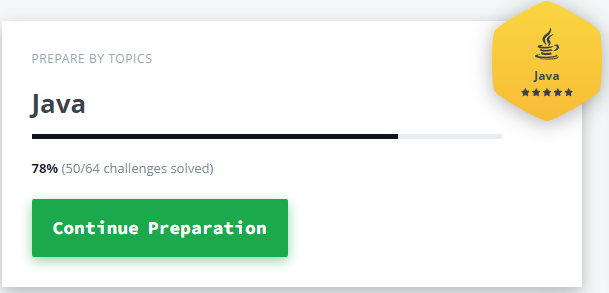

# 🏆 HackerRank Java Solutions

This repository houses solutions to 50 out of 64 coding challenges from [HackerRank](https://www.hackerrank.com/), all implemented in Java. It also includes a solution to a certification problem.

  

## 📘 Contents

1. [Introduction](#introduction)
2. [Java](#java)
3. [Algorithms](#algorithms)
4. [Data Structures](#data-structures)
5. [Certification Problem](#certification-problem)

## 💡 Introduction

The challenges are divided into several domains, and each domain includes a multitude of problems that you can solve using Java.

## ☕ Java

Here, you will find the solutions to the Java subsection, which encompasses problems related to Java programming concepts such as loops, data types, strings, etc.

## 💥 Algorithms

This section includes solutions to problems from the Algorithms subsection, which requires knowledge of search algorithms, sort algorithms, dynamic programming, and more.

## 🔩 Data Structures

In this section, you will find solutions to the Data Structures subsection, which tests your knowledge of data structures like arrays, trees, heaps, linked lists, etc.

## 🎖️ Certification Problem

This includes a solution to a certification problem.

## 🚀 Getting Started

### Prerequisites

- Java 8 or higher
- Any Java-supported IDE or text editor

### Usage

Each solution is a standalone java file.

## 📜 License

This project is licensed under the MIT License - see the [LICENSE.md](LICENSE.md) file for details.

## 📮 Contact

- GitHub [@EmanuelButoiGit](https://github.com/{EmanuelButoiGit})
- LinkedIn [Emanuel-Sebastian Butoi](https://www.linkedin.com/in/{emanuel-sebastian-butoi-929271213})

---

  Happy coding! 😊

